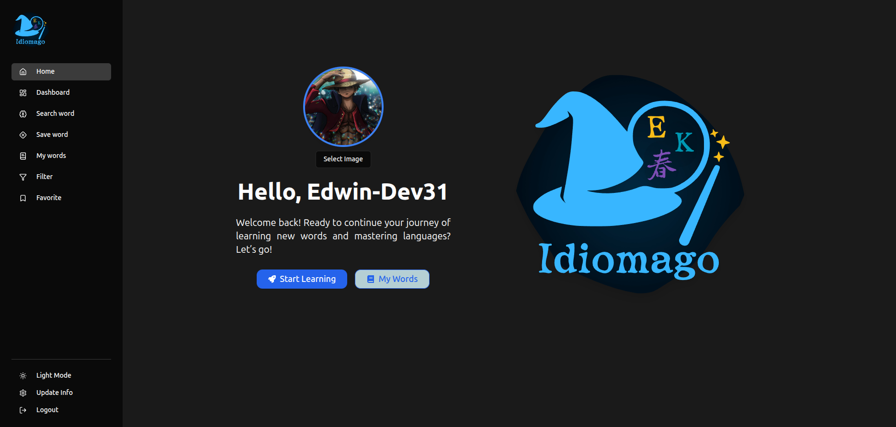
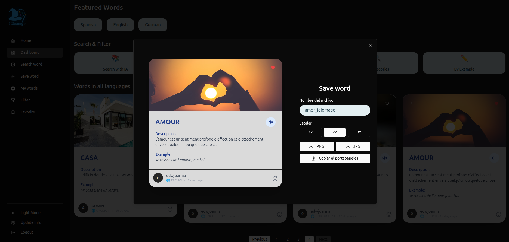

# 🌐 IdiomaGo - Language Learning App (Frontend)

This is the frontend for **IdiomaGo**, a modern language learning web application.  
It is built using **React + Vite**, styled with **Tailwind CSS** and **shadcn/ui**, and communicates with a backend written in **Spring Boot (Java)** using **PostgreSQL** as the database.

🌍 Live Demo: [idiomago-frontend on Azure](https://delightful-field-0bf6cfa0f.2.azurestaticapps.net)

---

## 🖼️ A Visual Tour of IdiomaGo

Explore the clean, modern, and user-friendly interface of IdiomaGo. The design focuses on providing an intuitive and engaging language-learning experience.

### Welcome to IdiomaGo!



---

### Share Your Knowledge

Easily share vocabulary with friends or on social media with our beautifully designed word cards. Here’s a preview of how they look:

**Desktop View**


---

## ✨ Features

- ✅ **OAuth Login**: Authenticate using **Google**, **GitHub**, or **Facebook**
- ✅ **Email verification**: Sends a confirmation email upon registration to ensure valid addresses
- 🌐 **Supports 40+ languages** for translation and practice
- 🤖 **AI-Powered Vocabulary Expansion**:
  - Add new words via AI
  - Supports up to **4 languages per request**
- 🧠 **Word management**:
  - Save, search, favorite, and organize learned words
- 🔒 **Protected routes** using token-based authentication

---

## ⚙️ Technologies Used

- [Vite](https://vitejs.dev/) – Fast build tool
- [React](https://react.dev/) – UI library
- [Tailwind CSS](https://tailwindcss.com/) – Utility-first CSS framework
- [shadcn/ui](https://ui.shadcn.com/) – Styled components for Tailwind
- [Axios](https://axios-http.com/) – HTTP client to consume the API
- [react-router-dom](https://reactrouter.com/) – SPA routing
- [react-hot-toast](https://react-hot-toast.com/) – Toast notifications

---

## 🔧 Backend

The frontend connects to a backend service developed with:

- **Spring Boot (Java)** – RESTful API
- **PostgreSQL** – Persistent database
- **Spring Security** – Authentication and OAuth
- **Email service** – To confirm user registration

You can find or connect it via the corresponding backend repository.

---

## 🚀 Getting Started

### 1. Clone the repository

```bash
git clone https://github.com/edwin-dev31/idiomago-frontend.git

cd idiomago-frontend
```

### 2. Install dependencies

```bash
npm install
```

### 3. Start the development server

```bash
npm run dev
```
