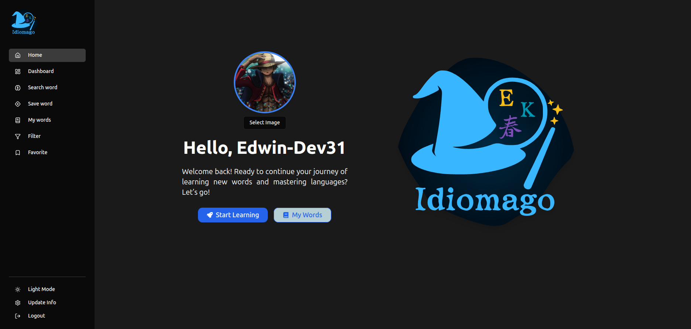
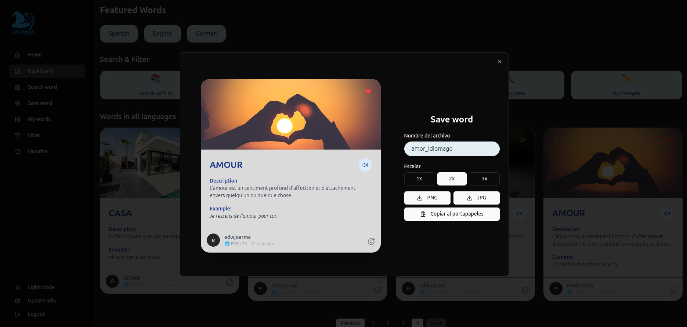

<p align="center">
  
  
  
  
  
  
</p>

# IdiomaGo Frontend

A modern language learning web application built with **React 19** and **Vite**. It connects to the [IdiomaGo Backend](https://github.com/edwin-dev31/idiomago-backend) for authentication, translations, and AI-powered vocabulary.

> **Live Demo:** [idiomago-frontend on Azure](https://idiomago.dev-ka.duckdns.org)

## Features

| Feature | Description |
|---------|-------------|
| **OAuth Login** | Sign in with Google, GitHub, or Facebook |
| **Email Verification** | Confirms valid email addresses on registration |
| **40+ Languages** | Translation and practice support |
| **AI Vocabulary** | Add new words via OpenAI (up to 4 languages per request) |
| **Word Management** | Save, search, favorite, and organize learned words |
| **Protected Routes** | Token-based authentication for secure access |
| **Word Cards** | Share vocabulary with beautifully designed cards |

## Tech Stack

| Technology | Purpose |
|------------|---------|
| **React 19** | UI framework |
| **TypeScript 5.7** | Type-safe JavaScript |
| **Vite 6.3** | Build tool and dev server |
| **Tailwind CSS 3.4** | Utility-first styling |
| **shadcn/ui + Radix UI** | Accessible component primitives |
| **MUI Material 7** | UI component library |
| **Framer Motion 12** | Declarative animations |
| **Lucide React** | Icon library |
| **Axios** | HTTP client |
| **react-router-dom 7** | SPA routing |
| **react-hot-toast** | Toast notifications |

## Screenshots

| Home Page | Word Card Sharing |
|-----------|-------------------|
|  |  |

## Getting Started

### 1. Clone & install

```bash
git clone https://github.com/edwin-dev31/idiomago-frontend.git
cd idiomago-frontend
npm install
```

### 2. Run development server

```bash
npm run dev
```

The app will open at **http://localhost:5173**.

## Backend

This frontend connects to the [**IdiomaGo Backend**](https://github.com/edwin-dev31/idiomago-backend) — a Spring Boot 3 API with JWT + OAuth2, PostgreSQL, and OpenAI integration.

## License

Distributed under the **MIT License**. See [LICENSE](./LICENSE) for more information.

---

<p align="center">
  <a href="https://github.com/edwin-dev31/idiomago-frontend/issues">Report a bug</a> ·
  <a href="https://github.com/edwin-dev31/idiomago-frontend/pulls">Request a feature</a>
</p>
